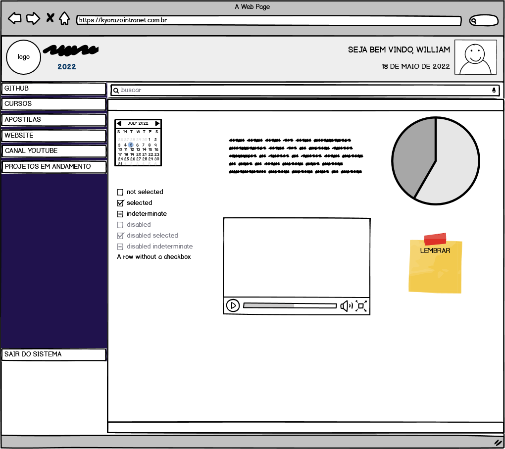

# 
Projeto  Intranet 

:exclamation:
:heavy_exclamation_mark: Projeto ainda em desenvolvimento :exclamation:
:heavy_exclamation_mark:

Projeto feito com:
 - Fron-end: HTML, CSS,, Boostrap e JavaScript
 - Back-end: PHP, JavaScript, Apache, MYSQL

O Intuito do projeto é aperfeiçoar o back-end e a lógica envolvendo regras de negócio de uma plataforma, nesse caso um projeto pessoal.
___
___
### Explicação da Aplicação 
A aplicaçaão web tem por finalidade reunir todas as informações da minha carreira profissional em um só lugar, ser acessível mesmo offline, ter conteúdos de programação, projetos que eu criei ou estou criando, noticias em geral, e utilidades para o  dia a dia de produção em desenvolvimento de projetos pessoais, profissionais ou de terceiros. 

### Idealizando o projeto através de um Mockup ou rascunho
&nbsp;
<figure>
    
</figure>

&nbsp;

# Construindo a aplicação web

> Uma vez que o mockup do projeto foi idealizado, o interessante seria fazer uma representação gráfica visual do projeto pronto, porém como o intuíto era o back-end procurei um template boostrap como base para trabalhar e fazer alguns ajustes.

Para desenvolver  esta aplicação web usei como Editor de código o VS Code pois é o meu editor preferido e Apache para o uso de um servidor local com MySQL, tuso resumido com o XAMPP.

---

# Funcionalidades da Intranet
- Login e logout
- Banco de dados
- Níveis de Acesso para cada usuário
- Validação de campos preenchidos no login
- Dashboard customizada para usuário logado
- Calendário 3D contendo uma frase diferente no verso todo dia
- Conversor de Moedas em tempo real consumindo API (Euro e Dolar)
- Horário em tempo real dinâmico
- Sessão Noticias consumindo (API Google News)
- CRUD de usuário com (Nível de acesso específico)
- Envio de E-mails com editor de texto Tinymce 
- Blog com alimentação por usuários
- Projetos em andamentos por usuáio logado
- Campo de Busca interna
- Tudo acontece na index da dashboard através de um Iframe

# Gif da Aplicação
Agora será mostrado como esta a Intranet atualmente.

&nbsp;

### Instalação
- Clone este repositorio atráves do terminal, VS Code 

## Acompanhe o resultado parcial deste projeto faça um teste
Você pode testar este projeto efetuando login com os seguintes dados:

usuario: roboto
senha: roboto123

Pode cadastrar o que quiser, não se preocupe ao efetuar o logout ou ao expirar a sessão todos os registros efetuados serão deletados automáticamente.

> Intranet Online -> [Acessar](https://phpintranet.infinityfreeapp.com/)

## Acompanhe também o resultado parcial deste projeto  no Youtube
> Projeto Intranet -> [Ver no youtube](https://www.youtube.com/watch?v=SSyommgWNSE&ab_channel=WilliamKyodev)

## Autor

> William Silva -> [Site e portfolio pessoal](https://bywilliams.github.io/portfolio/)

**Agradeço por terem acompanhdo a documentação e a explicação deste pequeno projeto, e trarei mais projetos.**

